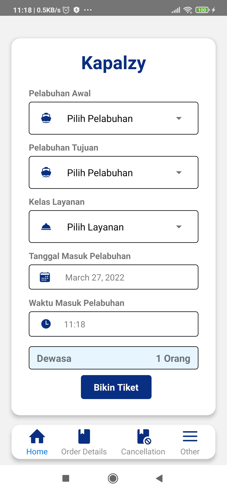
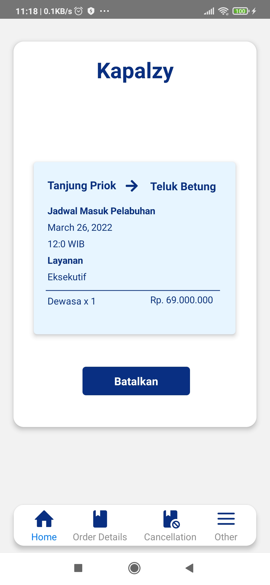
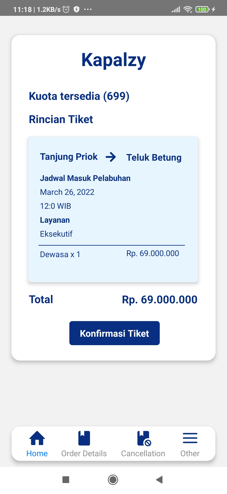
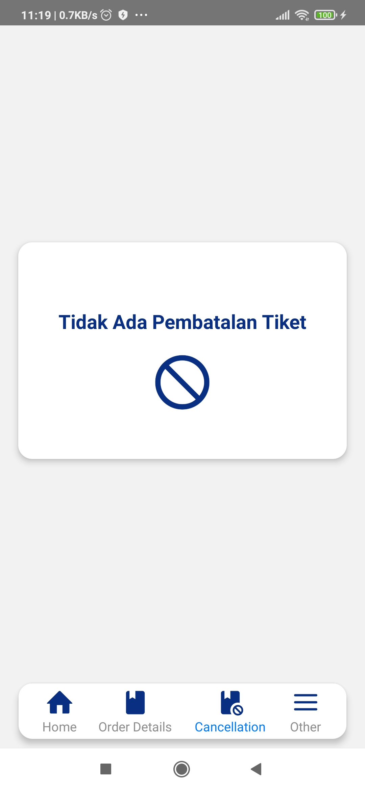
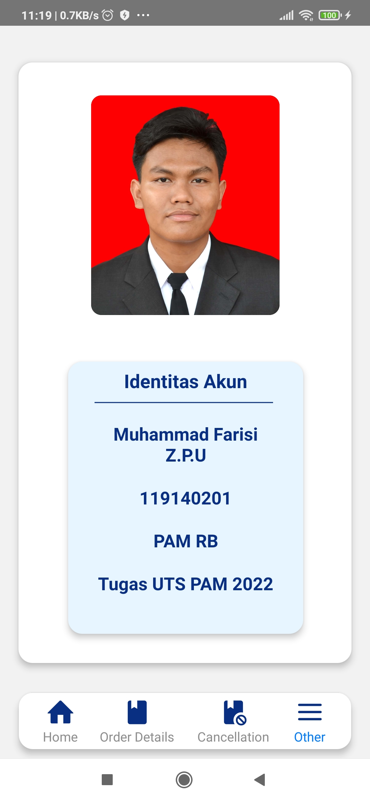

# UTS-PAM-APP
Ujian Tengah Semester Pengembangan Aplikasi Mobile (Individu)

# IDENTITAS MAHASISWA
Nama  : Muhammad Farisi Zatwara Putraa Unyi

NIM   : 119140201

Kelas : PAM RB

# PENJELASAN APLIKASI
Aplikasi Kapalzy ini dapat menerima pilihan lokasi pelabuhan tanjung priok, pelabuhan 
teluk betung, pelabuhan tanjung perak, dan pelabuhan air buaya untuk membuat tiket 
keberangkatan penumpang.

Aplikasi ini dibuat menggunakan:
1. React native
2. Android Studio
3. React Navigation
4. React Native Vector Icon
5. React Picker
6. React DateTimePicker
7. Moment

# SCEEENSHOT APLIKASI
<b>TAMPILAN APLIKASI</b>

<b>TAMPILAN HOME </b>

\

<b>TAMPILAN DETAIL </b>

<b>TAMPILAN KONFIRMASI </b>

<b>TAMPILAN PEMBATALAN</b>

<b>TAMPILAN LAINNYA</b>

